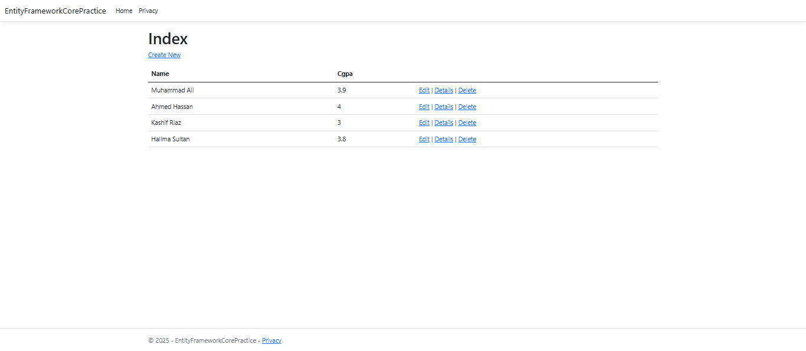

# Student Management Web App

A simple ASP.NET Core web application demonstrating Entity Framework Core integration with SQL Server database for managing student records.

## Features

- Display student records with ID, Name, and CGPA
- Entity Framework Core integration
- SQL Server database connectivity
- MVC architecture pattern
- Responsive web interface

## Technology Stack

- **Framework**: ASP.NET Core MVC
- **ORM**: Entity Framework Core
- **Database**: SQL Server
- **Language**: C#
- **Frontend**: HTML, CSS, JavaScript (via MVC Views)

## Project Structure

```
EntityFrameworkCorePractice/
├── Controllers/
│   └── HomeController.cs          # Main controller handling student data
├── Models/
│   ├── StudentModel.cs            # Student entity model
│   ├── StudentDbContext.cs        # Database context
│   └── ErrorViewModel.cs          # Error handling model
├── Views/
│   └── Home/
│       ├── Index.cshtml           # Student list view
│       └── Privacy.cshtml         # Privacy page
└── Program.cs                     # Application configuration
```

## Database Schema

The application uses a single `Student` table with the following structure:

| Column Name | Data Type | Description |
|-------------|-----------|-------------|
| s_id | INT (Primary Key) | Student ID |
| full_name | VARCHAR(100) | Student's full name |
| c_gpa | DECIMAL(3,2) | Student's CGPA (0.00-4.00) |

## Setup Instructions

### Prerequisites

- .NET 6.0 or later
- SQL Server (LocalDB, Express, or Full version)
- Visual Studio 2022 or Visual Studio Code

### Installation

1. **Clone the repository**
   ```bash
   git clone <repository-url>
   cd EntityFrameworkCorePractice
   ```

2. **Configure Database Connection**
   
   Update the connection string in `appsettings.json`:
   ```json
   {
     "ConnectionStrings": {
       "dbcs": "Server=(localdb)\\MSSQLLocalDB;Database=StudentDB;Trusted_Connection=true;MultipleActiveResultSets=true;TrustServerCertificate=True;"
     }
   }
   ```

3. **Install Dependencies**
   ```bash
   dotnet restore
   ```

4. **Create Database and Tables**
   
   Run the following commands in Package Manager Console:
   ```bash
   Add-Migration InitialCreate
   Update-Database
   ```

5. **Run the Application**
   ```bash
   dotnet run
   ```

   The application will be available at `https://localhost:5001` or `http://localhost:5000`

## Usage

1. **View Students**: Navigate to the home page to see all registered students
2. **Database Operations**: Currently supports read operations (display student list)

## Code Highlights

### Student Model
- Uses Data Annotations for database mapping
- Custom column names and data types
- Primary key configuration

### DbContext
- Simple DbContext implementation
- Configured with dependency injection
- SQL Server provider integration

### Controller
- Dependency injection of DbContext
- Retrieves and displays student data
- Standard MVC error handling

## Configuration

The application is configured in `Program.cs` with:
- MVC services registration
- Entity Framework DbContext configuration
- SQL Server connection setup
- Standard ASP.NET Core middleware pipeline

## Database Migration Commands

```bash
# Add new migration
Add-Migration <MigrationName>

# Update database
Update-Database

# Remove last migration
Remove-Migration

# View migration history
Get-Migrations
```

## Troubleshooting

### Common Issues

1. **Connection String Errors**
   - Verify SQL Server is running
   - Check connection string format
   - Ensure database exists

2. **Migration Issues**
   - Delete `Migrations` folder and recreate
   - Check model configurations
   - Verify DbContext registration

3. **Dependency Injection Errors**
   - Ensure DbContext is registered in `Program.cs`
   - Check constructor parameters match registered services

# Demonstration


---
**Note**: This is a basic implementation intended for learning Entity Framework Core concepts. For production use, consider implementing proper error handling, logging, security measures, and testing.
